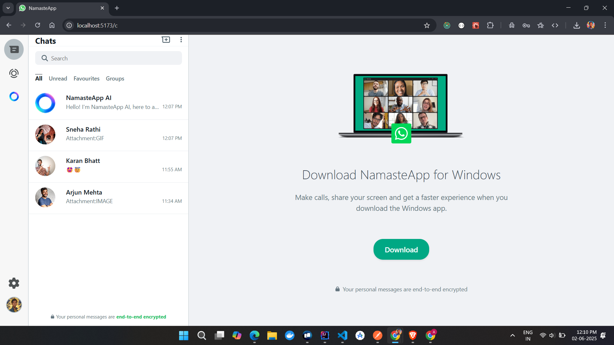
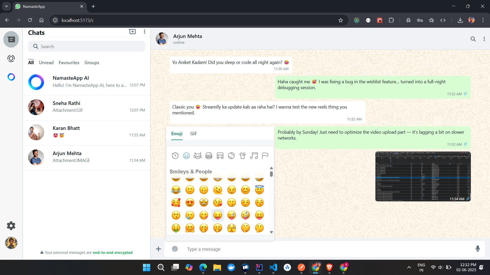
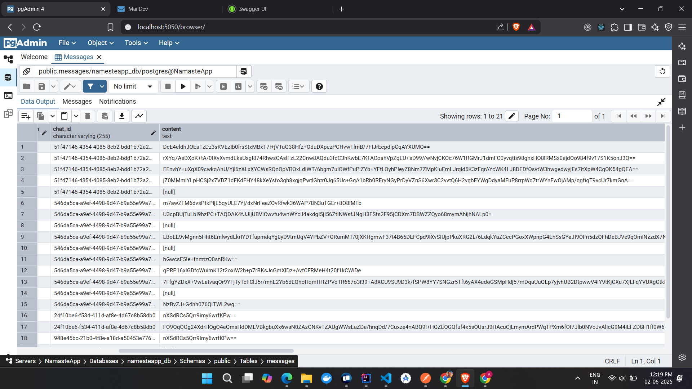
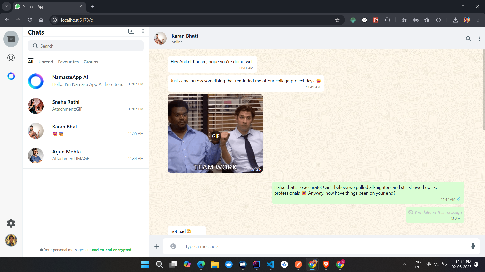
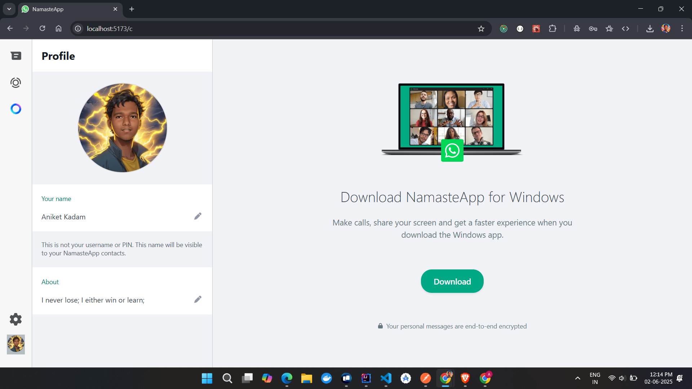
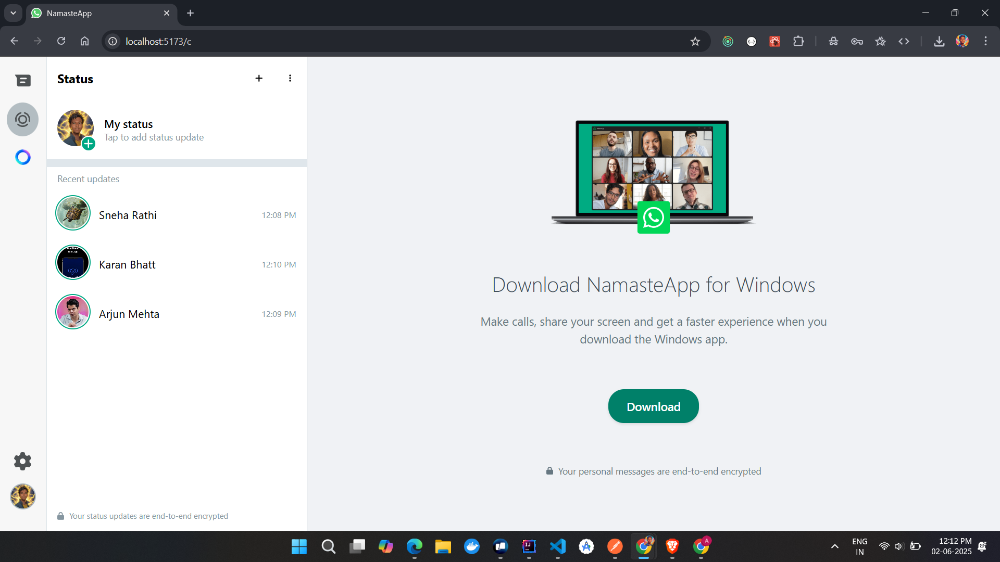
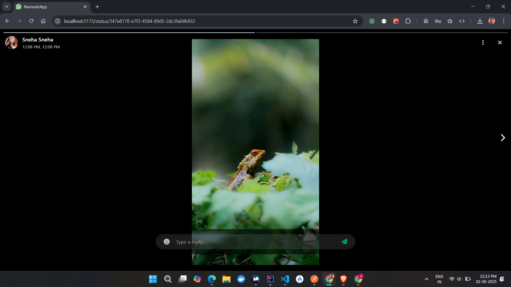
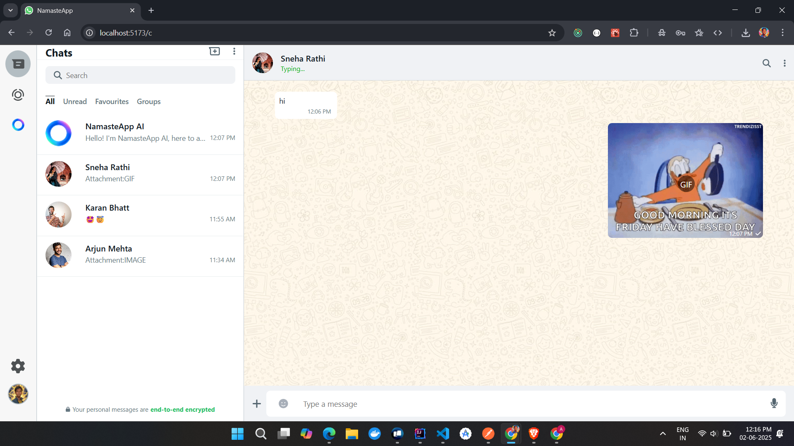

# WhatsApp Clone – Real-Time Chat App with AI Assistant
A secure, scalable, real-time chat backend inspired by WhatsApp. Built using modern backend technologies like Java, Spring Boot, WebSocket, PostgreSQL, and FFmpeg, and enhanced with AI capabilities using Spring AI and Ollama.

## Features
Real-Time Messaging
→ Instant messaging between users using WebSocket with message encryption.

🔹 Secure Authentication
→ OTP-based email verification & Google OAuth 2.0 login.

🔹 User Profiles
→ Upload and update profile pictures with backend storage support.

🔹 Video Uploads + Thumbnails
→ Upload video files and auto-generate thumbnails using FFmpeg.

🔹 End-to-End Message Encryption
→ Messages are encrypted before storing in the database.

🔹 Conversational AI Integration
→ Built-in AI assistant powered by Spring AI and Ollama for chatbot-style replies.

🔹 Containerized Deployment
→ Docker-ready for easy deployment and scalability.

## Project Screenshots

##  AI Assistant (Spring AI + Ollama)
- Uses Spring AI integration to connect with Ollama LLM.
- Can answer user questions, act as a support assistant, or help in the chat.
- Can be expanded to include prompts, sentiment detection, or summaries.

## Future Scope
- Add group chat and status features
- Voice/Video call integration
- 2FA
- Auto correct message (enhance messages)

### Author
Aniket Kadam |
Java Student |
Maharashtra, India |
aniketrkadam@gmail.com
